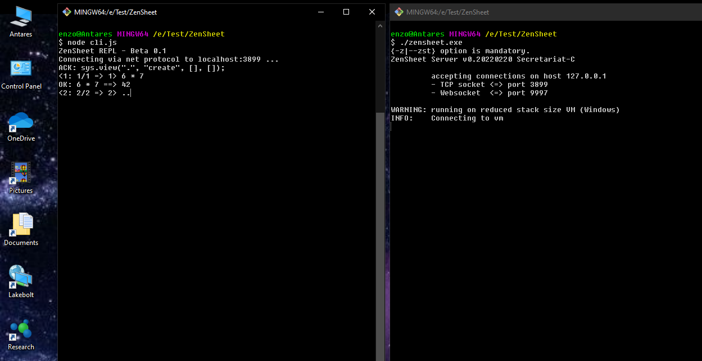

# ZenSheet

ZenSheet Beta distribution - Windows version

## Requisites

### 1. GitHub

You must have a GitHub account and the GitHub client (GitHub CLI ) for Windows.
Follow instructions in the following sites:

  https://github.com/
  https://cli.github.com/

### 2. Node.js

You must have a working Node.js installation.
To download and install Node.js, follow the instructions here: https://nodejs.org/en/
Here is sample shell interaction to verify that Node.js is working:

    liondance@Antares MINGW64 /e/Test/ZenSheet
    $ node
    Welcome to Node.js v16.14.0.
    Type ".help" for more information.
    > 6 * 7
    42
    > .exit

## Getting the ZenSheet distribution

    Create or choose a directory to hold a clone of the ZenSheet distribution
    Just make sure that there isn't a directory named ZenSheet already there

    Visit https://github.com/Liondance/ZenSheet
    Notice the green button labeled 'Code'
    Copy the connection string, which you will append to your git clone command

    Execute the following command in the chosen directory:
      git clone <connection string>
    For instance, using the connection string for the SSH protocol, the command will be:
      git clone git@github.com:Liondance/ZenSheet.git

## Testing the ZenSheet distribution

You two shell sessions

- ZenSheet REPL Client on the left
- ZenSheet Server on the right

